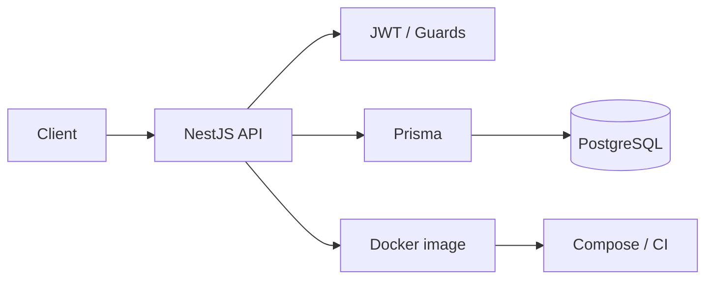

# Yamashita Sadao

**Backend engineer · DevOps · Full-stack TypeScript**

Building APIs and delivery pipelines that stay boring in production.

---

## About

I design and ship **server-side systems** with a DevOps bias: typed APIs, explicit auth, PostgreSQL as the source of truth, and the same image running locally as in CI.

Day to day that means NestJS modules, Prisma schemas, JWT session flows, Docker Compose stacks, and GitHub Actions that fail loudly instead of deploying guesses.

- Prefer **clear module boundaries** over clever abstractions
- Treat **auth, validation, and migrations** as product features
- Keep **local, CI, and production** as close as the Dockerfile allows

---

## Stack

  

| Layer | Tools |
| :--- | :--- |
| **Languages** | TypeScript, JavaScript, SQL |
| **Runtime & APIs** | Node.js, NestJS, Express |
| **Data** | PostgreSQL, Prisma |
| **Auth** | JWT, Passport, bcrypt |
| **Quality** | Jest, ESLint, Prettier, class-validator |
| **Delivery** | Docker, Docker Compose, GitHub Actions |

---

## How I build

| Concern | Default |
| :--- | :--- |
| HTTP surface | NestJS modules, DTOs, `class-validator` |
| Persistence | Prisma + PostgreSQL, migrations in source control |
| Identity | Passport JWT, hashed secrets, no header-spoofed user ids |
| Runtime | Multi-stage Dockerfiles, Compose for the full stack |
| Pipeline | GitHub Actions on every push: lint, test, image build |

---

## Focus

**APIs.** Resource design, validation, error contracts, and auth that an actual client can trust.

**Data.** Schema-first models, migrations you can replay, queries that stay inside the ORM until they shouldn't.

**Delivery.** Containerized Node services, Compose for local parity, CI that builds the same artifact you ship.

---

## GitHub

  
  

 

  

---

## Currently

- Hardening NestJS + Prisma services (auth, orgs, PostgreSQL)
- Tightening Docker and GitHub Actions so deploys are repeatable
- Writing down architecture decisions instead of keeping them in chat history

---

**[github.com/ysadao](https://github.com/ysadao)**

TypeScript · NestJS · PostgreSQL · Docker

